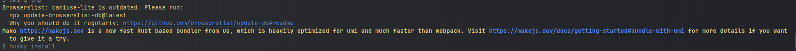
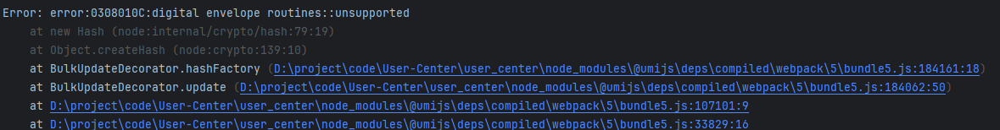

# User-Center

## 配置ant designer pro 及umi ui

npm i @ant-design/pro-cli@3.1.0 -g

pro create myapp

yarn

yarn add @umijs/preset-ui -D

安装旧版本的pro-cli
[Ant Design Pro按照官网创建了项目，无法使用umi ui？来看看我废了半条命找出来的解决方案_ant design pro umi ui-CSDN博客](https://blog.csdn.net/weixin_45084490/article/details/140238133#:~:text=Ant Design)

[终极解决：Error: error:0308010C:digital envelope routines::unsupported-CSDN博客](https://blog.csdn.net/m0_48300767/article/details/131450325)

使用npm版本为`20.18.0`

设置淘宝镜像`npm config set registry https://registry.npmmirror.com`

恢复默认镜像`npm config set registry https://registry.npmjs.org`



按照命令执行即可

快速删除node_model `rimfaf xxx`




npm>16版本需要加`set NODE_OPTIONS=--openssl-legacy-provider`


访问不到umiUI的库在 hosts 文件 添加

```
151.101.64.133 raw.githubusercontent.com
```


对于淘宝镜像的证书过期，切换新地址没用

兄弟们，我解决了，记住这个包`getnpmregistry`，看下你们的`node_modules`下面的这个包，里面有个`registryMap`字段，里面配置了`taobao`源

```
const registryMap = {
  taobao: "https://registry.npmmirror.com/",
  npm: "https://registry.npmjs.org"
};
```

把`taobao`源改成`https://registry.npmmirror.com/`就可以了

⚠️注意下：如果你用的是`pnpm`你还要去`node_modules`下面的`.pnpm`目录下面找`getnpmregistry`这个包，看下里面的`taobao`源配置的对不对，有可能`node_modules/getnpmregistry/index.js`里面的配置和`node_modules/.pnpm/getnpmregistry@1.0.1/node_modules/getnpmregistry/index.js`的不一致
